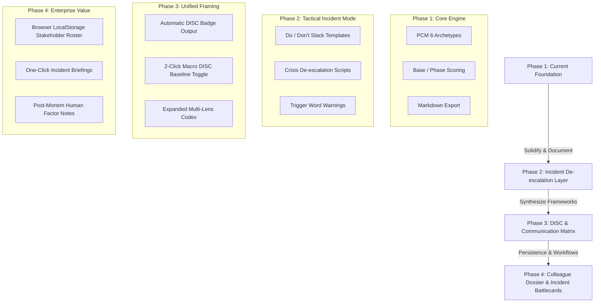

# The Behavioral Profiler — Strategic Field Manual & Architecture

> **A tactical psychological profiling and communication de-escalation tool designed for Incident Management, Technical Support, and Engineering Leadership.**

---

## 1. Executive Summary

When high-severity incidents, outages, or critical customer escalations strike, communication breakdown is almost always the true bottleneck. Engineers retreat into deep weeds, executives demand immediate binary answers, support agents absorb emotional heat, and leaders clash over priorities.

**The Behavioral Profiler** is a lightweight, zero-dependency, field-ready web application designed to be kept open in a browser tab. In under 60 seconds, a support engineer, incident commander, or manager can observe baseline cues, pinpoint an individual's psychological distress pattern, and receive immediate, actionable tactical scripts to de-escalate friction and drive aligned action.

---

## 2. Core Psychological Engine: The Two-Tier Model

The Profiler is built upon principles adapted from Dr. Taibi Kahler's **Process Communication Model (PCM)**—the framework famously utilized by NASA for astronaut crew selection and crisis de-escalation.

Traditional personality frameworks (like MBTI or Big Five) are descriptive and static—they tell you who someone is on a relaxed Sunday morning. PCM is **dynamic and behavioral**—it models how an individual's communication channel shifts under acute stress.

### The Two-Tier Architecture:
1. **Base (The Communication Channel / Filter):**
   - The neurological baseline established early in life.
   - Dictates how the person *perceives* information: through Thoughts (logic), Opinions (values), Emotions (feelings), Reactions (fun/spontaneity), Actions (direct movement), or Inactions (reflection).
   - **Tactical rule:** Speak to their Base to be understood.

2. **Phase (The Current Distress Driver & Conflict Stance):**
   - The psychological battery charger that needs replenishment right now.
   - Dictates how the person *acts out* when their needs are starved or when an incident creates acute pressure.
   - **Tactical rule:** Address their Phase need to de-escalate conflict.

```
+-------------------------------------------------------------+
|                     THE BEHAVIORAL STACK                    |
+-------------------------------------------------------------+
|  [PHASE] Current Stressor / Conflict Stance (Acute Distress)|
|          --> Determines: What they are demanding / fearing   |
+-------------------------------------------------------------+
|  [BASE]  Speech Tempo / Focus / Posture (Operating Channel) |
|          --> Determines: The vocabulary & cadence you speak  |
+-------------------------------------------------------------+
```

---

## 3. The 6 Core Archetypes in Incident Context

| Archetype | Perceptual Filter | What Triggers Distress in an Incident | Distress Behavior ("The Tell") | Tactical Incident Response (Do This) | What NEVER to Do |
| :--- | :--- | :--- | :--- | :--- | :--- |
| **The Thinker** | Logic, Data, Structure | Ambiguity, lack of data, moving goalposts | Over-explains, nitpicks, weaponizes facts, micromanages | Provide structured bullet points, timestamps, and verifiable data | Don't make emotional appeals or hand-wave details |
| **The Persister** | Values, Principles, Respect | Perceived incompetence, broken trust, ethical compromise | Becomes dogmatic, preaches, pushes rigid opinions | Solicit their opinion, validate their dedication, align on principles | Don't dismiss their convictions or call their concern "trivial" |
| **The Harmonizer** | Empathy, Relationships | Hostility, aggression, cold detachment | Over-apologizes, freezes, makes careless mistakes to solicit rescue | Use "we" language, acknowledge personal stress, provide psychological safety | Don't bark orders or treat them as a mere cog in the machine |
| **The Rebel** | Spontaneity, Reactions | Strict constraints, micromanagement, dull bureaucracy | Blames others, acts sarcastic in Slack, actively defies process | Offer discrete choices, keep energy dynamic, challenge them to problem-solve | Don't impose heavy-handed rules or lecture them on protocol |
| **The Promoter** | Direct Action, Immediate Wins | Stagnation, analysis paralysis, slow deliberation | Manipulates, escalates prematurely, steamrolls others | Give the bottom-line payoff immediately, challenge them to clear blockers | Don't provide long backstories or show hesitation |
| **The Imaginer** | Reflection, Spatial Clarity | Sensory overload, rapid-fire cross-talk, forced group consensus | Completely withdraws, goes unresponsive on the bridge call | Give them quiet space, send 1-on-1 direct requests rather than open questions | Don't force public on-the-spot group brainstorming |

---

## 4. DISC vs. PCM: Strategic Synthesis

A common question is: **"Should we incorporate DISC alongside this, or is it overkill?"**

### The Diagnosis:
- **DISC** is macro, static, and universally understood in corporate management:
  - **D (Dominance):** Direct, firm, results-oriented (Fast + Task)
  - **I (Influence):** Outgoing, enthusiastic, inspiring (Fast + People)
  - **S (Steadiness):** Calm, patient, accommodating (Deliberate + People)
  - **C (Conscientiousness):** Analytical, reserved, precise (Deliberate + Task)
- **PCM** is micro, dynamic, and distress-oriented:
  - It explains why an engineer who is normally a quiet "C" suddenly starts barking orders like an aggressive "D" (Promoter phase distress), or why a manager who is normally a "D" suddenly withdraws completely into silence (Imaginer phase distress).

### The Recommendation:
**Do not force a redundant 20-question DISC test into the incident triage flow.** During an outage or high-stress conflict, cognitive load must remain minimal.

Instead, utilize a **Synthesized Dual-Lens approach**:
1. **Automatic DISC Mapping:** The engine can natively display the DISC archetype corresponding to the observed PCM pattern:
   - *Thinker* $\rightarrow$ **High C** (Analytical / Systematic)
   - *Persister* $\rightarrow$ **High D / High C** (Principled / Determined)
   - *Harmonizer* $\rightarrow$ **High S** (Supportive / Empathetic)
   - *Rebel* $\rightarrow$ **High I / D** (Expressive / Disruptive)
   - *Promoter* $\rightarrow$ **High D** (Driver / Competitive)
   - *Imaginer* $\rightarrow$ **High C / S** (Reflective / Deliberate)
2. **The "Incident High-D Reality":** In operational emergencies, almost all executives and clients temporarily adopt an aggressive **High-D presentation** ("What is broken, when is it fixed, who is fixing it?"). Recognizing whether this is their *true base* or a *distress phase masking a panic-stricken Thinker or Harmonizer* allows frontline staff to tailor their response perfectly.

---

## 5. How to Use the App (60-Second Quick Start)

1. **Fire up the app:** Double-click `the_behavioral_profiler.html` in any browser (Chrome, Edge, Firefox, Safari). No installation, Node.js, or server required.
2. **Enter the Subject Identifier:** Type the name or role (e.g., *"VP Engineering"*, *"Escalated Customer Acme Corp"*, *"On-Call DBA"*).
3. **Level 1: Tap Base Indicators (Observation):**
   - *Speech Tempo:* How fast are they talking/typing?
   - *Primary Focus:* Are they fixated on Tasks, People, Principles, Action, or Ideas?
   - *Posture / Demeanor:* Are they upright/tense, relaxed, or fidgety?
4. **Level 2: Tap Phase Indicators (Distress Probe):**
   - *Motivator:* What are they starving for? (Status, Security, Space, Approval?)
   - *Stressor:* What triggered the blowout? (Time crunch, loss of control, friction?)
   - *Conflict Stance:* When cornered, do they blame, lecture, withdraw, or dominate?
5. **Hit "Analyze Profile":**
   - Instantly read the **Communication Channel**, **Current Driver**, and **Distress Tell**.
   - Read the **Frontline Strategy** (immediate de-escalation tactics).
   - Read the **Management Insight** (long-term positioning and team dynamics).
6. **Export & Log:** Click **Save .MD** to download a structured incident debrief markdown report for handovers or 1-on-1 retrospectives.

---

## 6. Strategic Roadmap & Expansion Plan

Here is the architectural plan for expanding the tool into an indispensable organizational asset:



### Application Navigation & Tabs Architecture:
1. **Active Profiler (Rapid Triage):** The core fast-input engine for real-time profiling, DISC alignment, and copy-paste incident scripts. Includes dynamic autocomplete matching known names and aliases.
2. **The Dossier Library (Multi-Observer Archive):** Persistent client-side archive storing multiple timestamped observations per person. Tracks observer identity, environment context, situational divergence, and includes a 1-click merge engine for typo consolidation.
3. **The Codex & Playbooks:** Comprehensive reference manual combining PCM archetypes, DISC quadrants, and frontline de-escalation battlecards.

---

## 7. Live-Fire Drills & Multi-Observer Intelligence

A premier use case for **The Behavioral Profiler** is team training exercises. When training frontline support engineers or managers in a live-fire incident simulation:

1. **Simultaneous Observation:** Multiple team members independently observe a subject (e.g. an incident commander or executive actor) during the drill.
2. **Card Ingestion:** Observers export their markdown cards (`.md`), and the team lead uses **Import Cards** to ingest all files in batch.
3. **Situational Divergence Analysis:** The Dossier clusters the cards under the subject and highlights:
   * **Base Consensus:** Percentage agreement on the subject's baseline channel.
   * **Phase Divergence:** Divergences across environments (*"Promoter Phase during high-pressure outages vs. Thinker Phase during 1-on-1 reviews"*).
4. **Typo & Alias Consolidation:** If different observers enter *"Sarah (VP)"*, *"Sarah"*, or make a typo like *"Sarha"*, the **Merge Duplicate Subject** utility merges them into a single profile while retaining all historical observer logs.

---

## 8. Ethical Code & Field Guidelines

> *"The purpose of profiling is not manipulation, labeling, or pigeonholing. The purpose is empathy in high-friction environments."*

1. **The Platinum Rule:** The Golden Rule says *"Treat others how you want to be treated."* The Platinum Rule of incident management says *"Treat others how they need to be treated to stay calm and functional."*
2. **Profiles are States, Not Life Sentences:** A person's phase shifts depending on sleep, pressure, life circumstances, and organizational safety. Always profile the *interaction*, not just the *person*.
3. **Strict Client-Side Privacy:** This application runs 100% locally in the browser memory. No data, names, notes, or profile assessments are ever transmitted over a network.
